# SecureBank — Descope Integration Lab Guide

A step-by-step guide to integrating Descope authentication into the SecureBank demo app.
Follow each use case in order — each builds on the previous one.

---

## Prerequisites

Before you begin:

- [ ] Clone the repo and run `npm install` (see [SETUP.md](SETUP.md))
- [ ] Create a free account at [app.descope.com](https://app.descope.com)
- [ ] Create a new Descope project named `SecureBank`
- [ ] Copy your **Project ID** from Console → Project Settings
- [ ] Generate a **Management Key** from Console → Company → Management Keys
- [ ] Create a `.env.local` file with both values (see [SETUP.md](SETUP.md))

---

## Use Case 1 — User Import

### What's happening here?

When migrating users from a legacy system to a new identity provider like Descope, one of the biggest concerns is disruption — you don't want to force every user to reset their password just because the backend changed. Descope solves this with **hashed password import**: you export the password hashes from your old database and pass them directly to Descope. From that point on, when a user logs in with their existing password, Descope verifies it against the imported hash transparently. The user never knows a migration happened.

In this demo, `lib/data.ts` acts as the legacy database. It stores passwords in plaintext (which a real system would never do — a real DB would store bcrypt hashes). The migration script simulates what a real engineering team would do:
1. Export users and their password hashes from the old database
2. Call Descope's Batch Create Users API to import them
3. Tag each user with `freshlyMigrated: true` so the app can trigger a passkey enrollment flow on their next login (Use Case 3)

---

### API used

**`POST https://api.descope.com/v1/mgmt/user/create/batch`**

This is a **Management API** — it requires a Management Key, not a user session token. It's meant to be called server-side only (migration scripts, backend jobs) and should never be exposed to the browser.

Key request fields:

| Field | Description |
|-------|-------------|
| `loginIdOrUserId` | The unique login identifier — we use the email address |
| `email` | The user's email |
| `verifiedEmail: true` | Marks the email as already verified — skips re-verification since the legacy system already verified it |
| `displayName` | The user's full name |
| `hashedPassword.bcrypt.hash` | The bcrypt hash string — Descope will verify future logins against this |
| `customAttributes.freshlyMigrated` | A custom boolean flag we define — used in Use Case 3 to detect first-time logins and prompt passkey enrollment |

**SDK:** `@descope/node-sdk` → `descope.management.user.createBatch(users)`

Descope supports these hashing algorithms for import: `bcrypt`, `argon2`, `pbkdf2`, `firebase`, `django`, `phpass`, `md5`, and `sha` variants. This means you can migrate from virtually any major stack without forcing password resets.

---

### Step 1 — Create the `freshlyMigrated` custom attribute

Before importing users, you need to define the `freshlyMigrated` attribute in your Descope project. Descope won't accept unknown custom attributes — they must be declared in the schema first.

This attribute is a boolean flag that will be set to `true` on every imported user. Later, in Use Case 3, the app checks this flag after login to decide whether to show the passkey enrollment prompt.

1. Go to **Console → Users → Custom Attributes** tab
   ([app.descope.com/users/attributes](https://app.descope.com/users/attributes))

   > 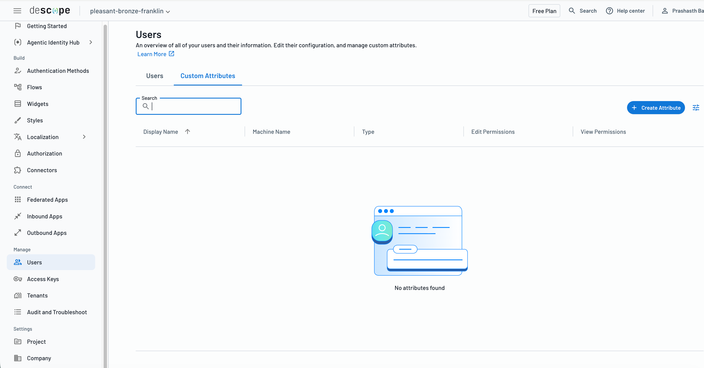

2. Click **+ Create Attribute** and fill in:
   - **Display Name:** `Freshly Migrated` — human-readable label shown in the Console
   - **Machine Name:** `freshlyMigrated` — auto-fills; this is the key used in code
   - **Type:** `Boolean` — since this is a true/false flag

   > 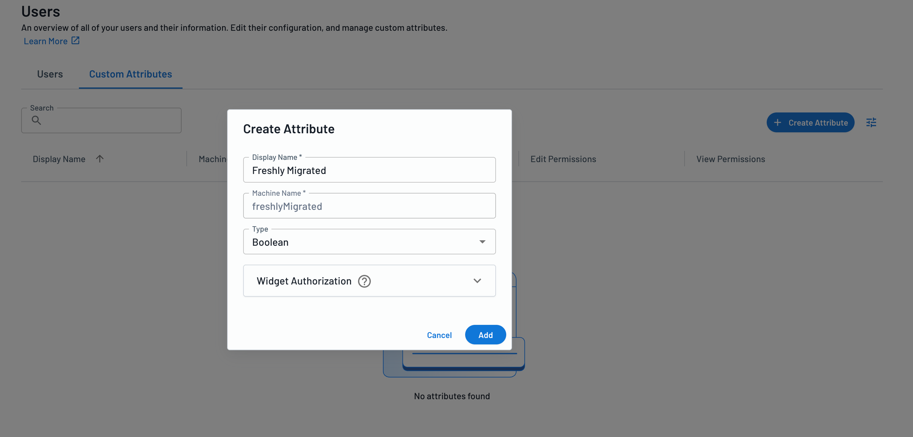

3. Click **Add**. You should now see the attribute listed:

   > 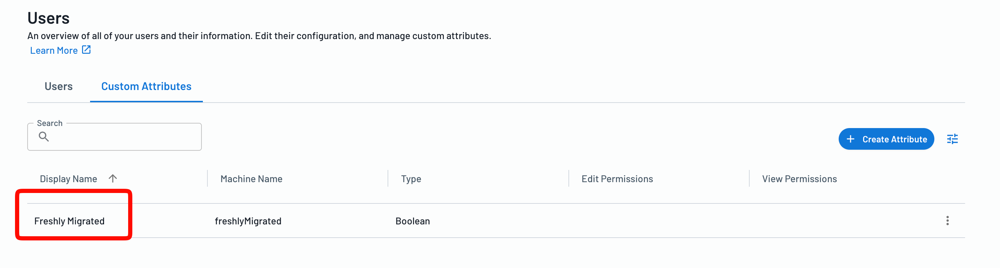

---

### Step 2 — Get your Project ID and Management Key

You need two credentials from Descope to authenticate the migration script.

**Project ID** identifies your Descope project. It's safe to use in frontend code (prefixed with `NEXT_PUBLIC_`) since it's not a secret — it's like a project name.

1. Go to **Console → Settings → Project**
2. Copy the **Project ID** field (starts with `P2...`)

   > 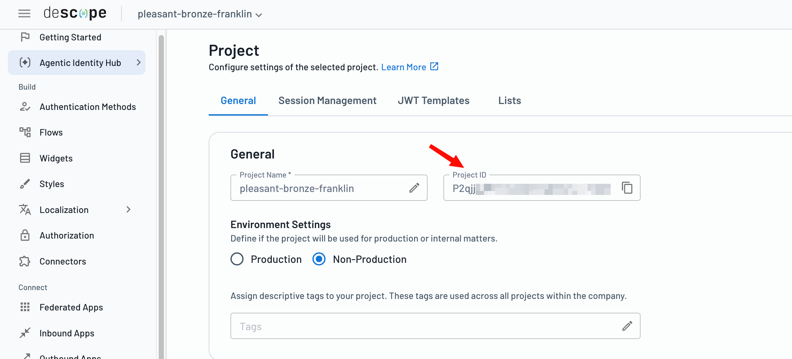

**Management Key** is a privileged server-side secret that grants access to Descope's Management APIs (create users, delete users, etc.). Treat it like a database password — never commit it or expose it in the browser.

1. Go to **Console → Settings → Company → Management Keys**
2. Click **+ Management Key** and fill in:
   - **Name:** `securebank`
   - **Description:** `securebank demo`
   - **Expiration:** `30 Days` — for demos, short expiry is fine; production keys should be rotated regularly
   - **Roles:** `Full Access` — needed to create and manage users

   > 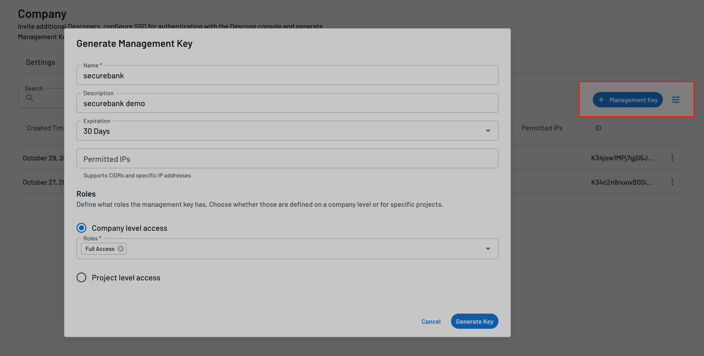

3. Click **Generate Key**. Copy the key immediately — Descope shows it only once and cannot retrieve it later.

   > 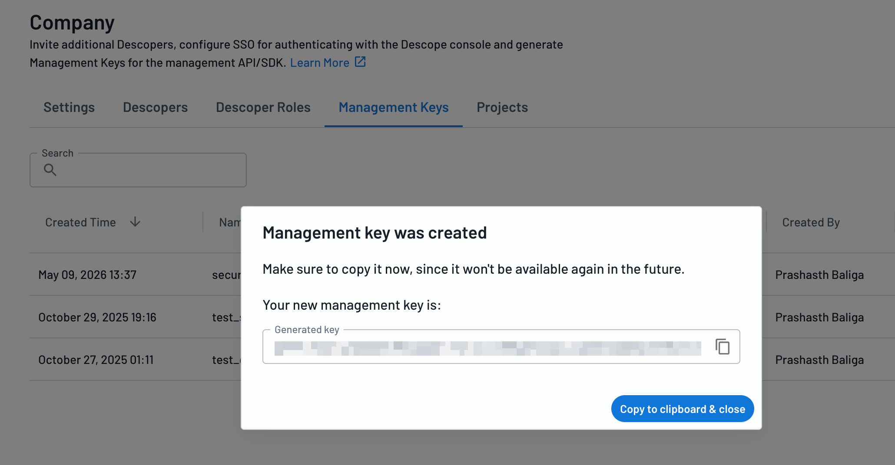

4. Create a `.env.local` file in your project root and add both values:

   ```
   NEXT_PUBLIC_DESCOPE_PROJECT_ID=<your-project-id>
   DESCOPE_MANAGEMENT_KEY=<your-management-key>
   ```

   > **Important:** `.env.local` is already listed in `.gitignore` — it will never be committed. Never hardcode these values in your source files.

---

### Step 3 — Install dependencies

The migration script needs two packages:
- **`bcryptjs`** — to hash the legacy plaintext passwords before importing (simulating what a real DB export would contain)
- **`@descope/node-sdk`** — Descope's server-side SDK for calling the Management API
- **`tsx`** — runs TypeScript files directly without a build step (dev only)

```bash
npm install bcryptjs @descope/node-sdk
npm install --save-dev @types/bcryptjs tsx
```

---

### Step 4 — Review the migration script

Open `scripts/migrate-users.ts`. Here's what it does step by step:

```typescript
// 1. For each legacy user, generate a bcrypt hash of their plaintext password
const hash = await bcrypt.hash(user.password, SALT_ROUNDS);

// 2. Build the Descope user object with the hash and freshlyMigrated flag
return {
  loginIdOrUserId: user.email,
  email: user.email,
  verifiedEmail: true,        // already verified in the legacy system
  displayName: user.name,
  customAttributes: { freshlyMigrated: true },
  hashedPassword: {
    bcrypt: { hash },         // Descope stores this and verifies future logins against it
  },
};

// 3. Call the Batch Create Users API
const { data, error } = await descope.management.user.createBatch(batchUsers);
```

`SALT_ROUNDS = 10` is the bcrypt work factor — higher is more secure but slower to hash. 10 is the industry standard for most applications.

---

### Step 5 — Run the migration

```bash
npx tsx scripts/migrate-users.ts
```

Expected output:
```
Migrating 2 users to Descope...

  Hashed password for priya@securebank.com
  Hashed password for alex@securebank.com

Results:
  ✓ priya@securebank.com — imported
  ✓ alex@securebank.com — imported

Migration complete.
```

---

### Step 6 — Verify in Descope Console

Navigate to **Console → Users** and confirm both Priya and Alex appear. Notice their status is **Invited** — this is normal for batch-imported users. They become **Active** after their first login.

> 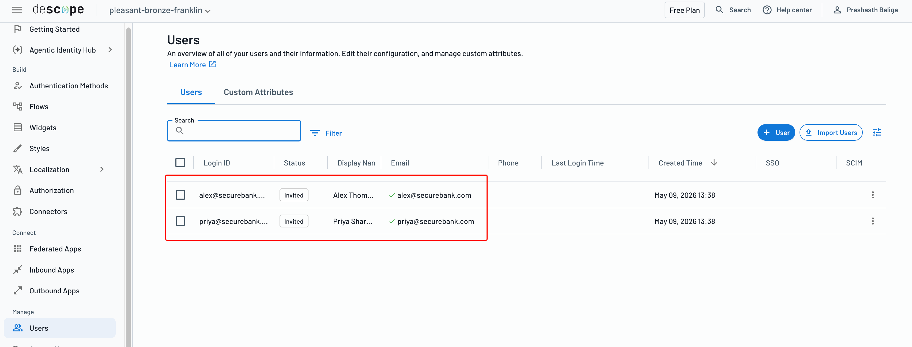

Click on **Priya Sharma** to open her profile. Scroll down and confirm:
- Email is verified (checkmark next to email)
- **Freshly Migrated** checkbox is checked

> 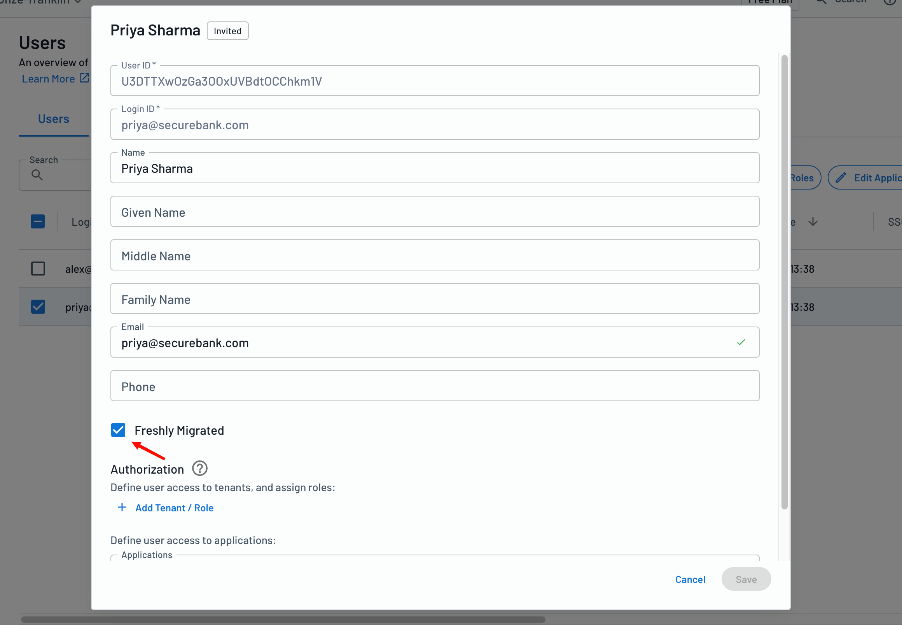

✅ **Use Case 1 complete.** Both users are now in Descope with bcrypt-hashed passwords and `freshlyMigrated: true`. They can log in with their existing password (`Test@123`) without any reset — and the app will detect the flag to prompt passkey enrollment in Use Case 3.

---

## Use Case 2 — Password Auth

### What's happening here?

In Use Case 1 we imported Priya and Alex into Descope with their bcrypt-hashed passwords. Now we need to actually replace the fake login form in the app with a real authentication flow powered by Descope.

Currently, the app has a custom HTML form in `app/page.tsx` that checks the user's email and password against hardcoded values in `lib/data.ts`. This is not real authentication — anyone who reads the code can see the passwords. We are going to remove this entirely and replace it with a **Descope Flow**.

A Descope Flow is a no-code authentication journey you build in the Descope Console. When you embed it in your app, Descope renders the UI and handles all the authentication logic — checking if the user exists, verifying the password, managing the session — without you writing any of that code yourself.

After this use case:
- The login form is powered by Descope
- Priya and Alex log in with their real passwords (`Test@123`) verified against the bcrypt hashes stored in Descope
- On success, Descope creates a JWT session — a secure token that proves the user is logged in
- The app reads that token to identify who is logged in

---

### API / SDK used

**Descope Next.js SDK** — `@descope/nextjs-sdk`

This is Descope's official SDK for Next.js App Router applications. It provides:

| Component / Hook | What it does |
|-----------------|--------------|
| `<AuthProvider>` | Wraps the app — initializes Descope with your Project ID |
| `<Descope flowId="...">` | Renders a Descope Flow inside your page |
| `useSession()` | Returns `isAuthenticated` — whether the user has a valid session |
| `useUser()` | Returns the logged-in user's profile (email, name, etc.) |
| `useDescope()` | Gives access to `logout()` and other SDK methods |

The Flow used is **`sign-up-or-in-passwords`** — a template from Descope's Flow library that:
1. Asks for an email
2. Checks if the user exists in Descope
3. If yes → asks for password → verifies against stored hash → creates session
4. If no → triggers sign-up (not used in this demo)

---

### Step 1 — Create the password flow in Descope Console

First, go to **Console → Flows** to see your existing flows:

> 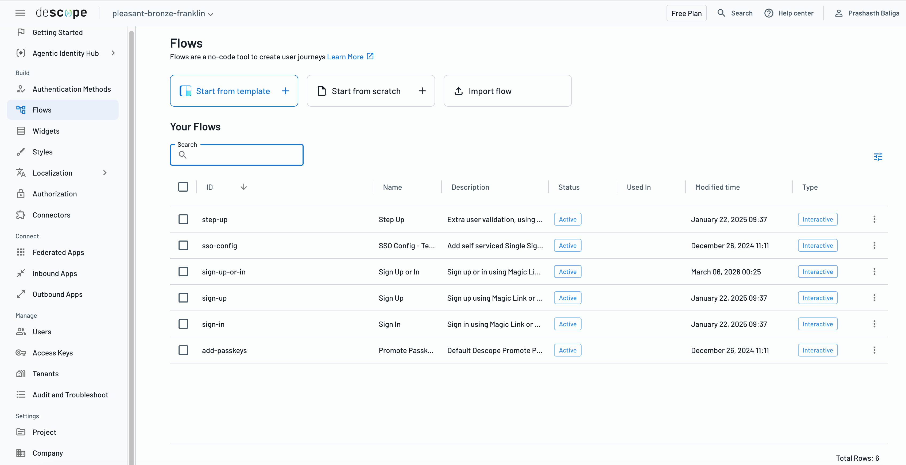

Click **Start from template**, then filter by **Password**:

> 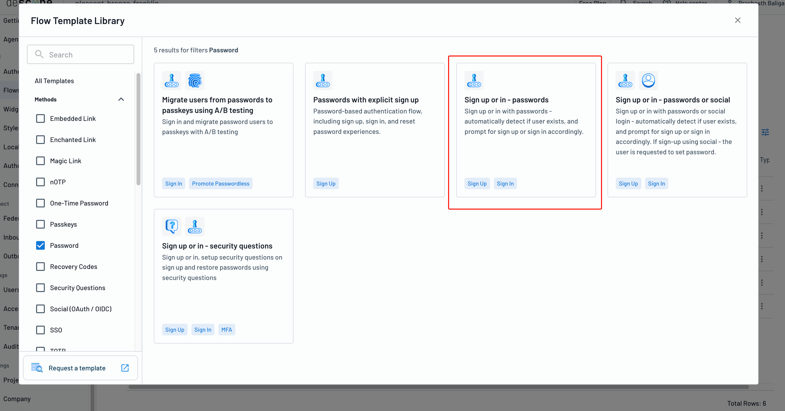

Select **"Sign up or in - passwords"**. This creates a flow that automatically detects whether the user is signing in or signing up. The flow diagram looks like this:

> 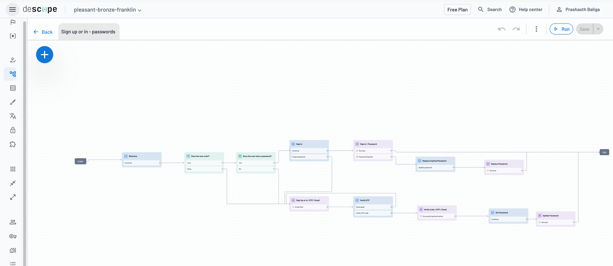

When asked to confirm the flow details, note the **Flow ID** — this is what you'll use in the code:

> 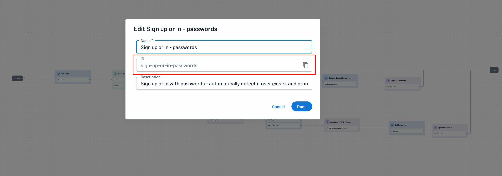

Save the flow. It will now appear in your flows list:

> 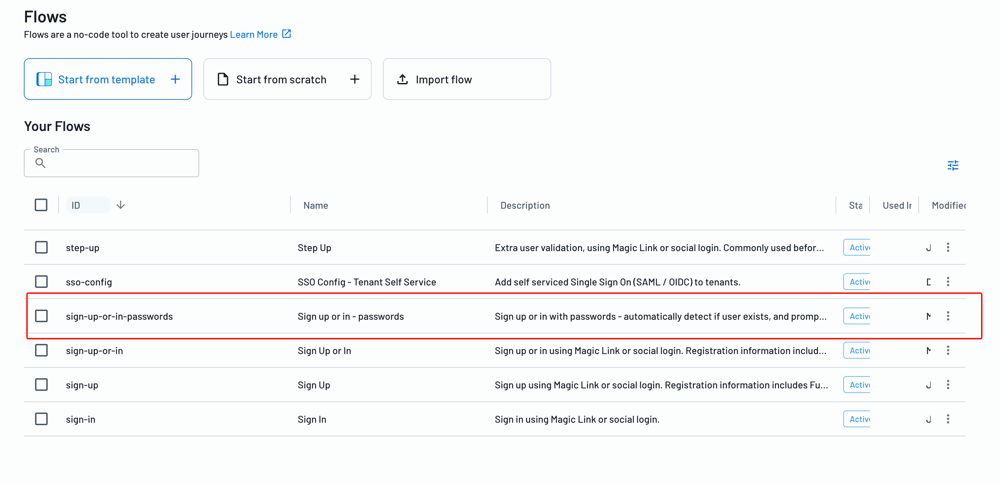

---

### Step 2 — Customise the flow screen (optional)

By default the flow shows "Welcome" as its heading — which clashes with the "Welcome Back" text in the SecureBank app. You can change it in the flow editor by clicking on the **Welcome** screen node and editing the heading text.

> 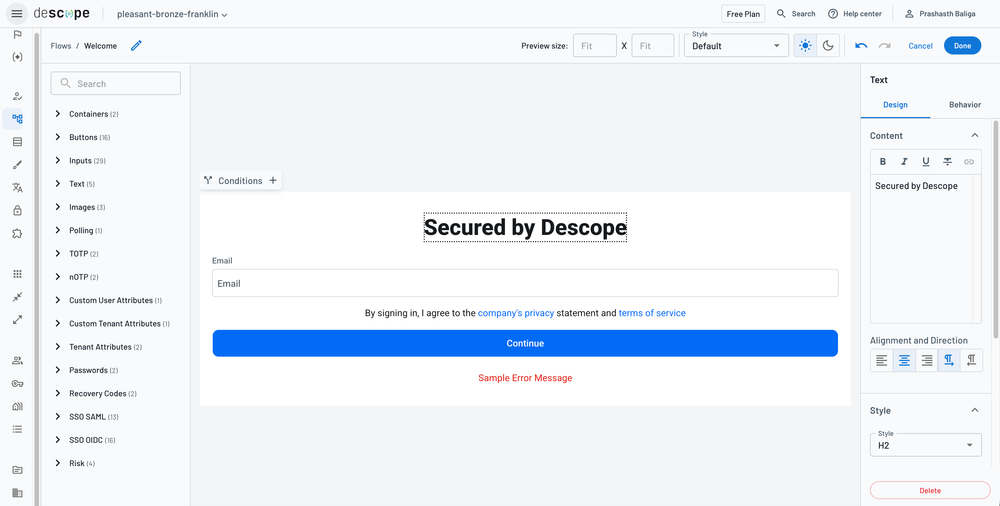

Click **Done** to save.

---

### Step 3 — Install the Descope Next.js SDK

Open your terminal in the project folder and run:

```bash
npm install @descope/nextjs-sdk
```

This installs Descope's official SDK for Next.js. You only need to run this once.

---

### Step 4 — Update `app/layout.tsx`

Open the file `app/layout.tsx`. This is the root layout of the app — every page is wrapped by it.

> **How to do it:** Open the file in your editor, press `Cmd+A` (Mac) or `Ctrl+A` (Windows) to select all, then delete. Paste the code below.

Here is what the **original file** looks like (for reference — do not keep this):

```tsx
import type { Metadata } from "next";
import "./globals.css";
import { AuthProvider } from "@/lib/auth"; // ❌ Only the mock auth provider

export const metadata: Metadata = { ... };

export default function RootLayout({ children }) {
  return (
    <html lang="en">
      <body>
        <AuthProvider>{children}</AuthProvider> {/* ❌ No Descope here */}
      </body>
    </html>
  );
}
```

**Replace the entire file with:**
```tsx
import type { Metadata } from "next";
import "./globals.css";
import { AuthProvider as DescopeProvider } from "@descope/nextjs-sdk";
import { AppProvider } from "@/lib/auth";

export const metadata: Metadata = {
  title: "SecureBank — Your Trusted Banking Partner",
  description: "SecureBank demo application",
};

export default function RootLayout({ children }: { children: React.ReactNode }) {
  return (
    <html lang="en">
      <body>
        <DescopeProvider projectId={process.env.NEXT_PUBLIC_DESCOPE_PROJECT_ID!}>
          <AppProvider>{children}</AppProvider>
        </DescopeProvider>
      </body>
    </html>
  );
}
```

**What changed and why:**

| What | Why |
|------|-----|
| `import { AuthProvider as DescopeProvider } from "@descope/nextjs-sdk"` | Imports Descope's provider — renamed to avoid clash with the existing `AuthProvider` name |
| `<DescopeProvider projectId={...}>` wraps everything | Initializes Descope for the whole app using your Project ID from `.env.local` — must be the outermost wrapper |
| `AuthProvider` from `lib/auth` renamed to `AppProvider` | Same file, new name — it still handles business data (balances, transactions) but no longer does authentication |

---

### Step 5 — Update `lib/auth.tsx`

Open `lib/auth.tsx`. This is the file that currently manages who is logged in. It has a fake `login()` function that checks hardcoded passwords in `lib/data.ts` — not real authentication.

We are going to **delete everything in this file** and replace it with a new version that uses Descope's session hooks instead.

> **How to do it:** Open the file in your editor, press `Cmd+A` (Mac) or `Ctrl+A` (Windows) to select all, then delete. Paste the code below.

Here is what the **original file** looks like (for reference — do not keep this):
```tsx
"use client";
import { createContext, useContext, useState, ReactNode } from "react";
import { User, Transaction, USERS, TRANSACTIONS } from "./data";

// ❌ This type includes a login() function — we are removing this
type AuthContextType = {
  user: User | null;
  login: (email: string, password: string) => { success: boolean; error?: string };
  logout: () => void;
  // ...
};

export function AuthProvider({ children }: { children: ReactNode }) {
  const [user, setUser] = useState<User | null>(null);

  // ❌ This checks passwords against hardcoded data — not real auth
  const login = (email: string, password: string) => {
    const found = users.find(
      (u) => u.email === email && u.password === password
    );
    setUser(found);
    return { success: !!found };
  };

  // ❌ This just clears a React variable — not a real logout
  const logout = () => setUser(null);
}
```

**Now replace the entire file with this new version:**
```tsx
"use client";
import { createContext, useContext, useState, ReactNode } from "react";
import { useUser, useSession, useDescope } from "@descope/nextjs-sdk/client";
import { User, Transaction, USERS, TRANSACTIONS } from "./data";

type AppContextType = {
  user: User | null;
  users: User[];
  transactions: Transaction[];
  disabledUsers: string[];
  logout: () => void;
  toggleUser: (id: string) => void;
  transfer: (recipientId: string, amount: number, note: string) => { success: boolean; error?: string };
};

const AppContext = createContext<AppContextType | null>(null);

export function AppProvider({ children }: { children: ReactNode }) {
  const { user: descopeUser } = useUser();
  const { isAuthenticated } = useSession();
  const { logout: descopeLogout } = useDescope();

  const [users, setUsers] = useState<User[]>(USERS);
  const [transactions, setTransactions] = useState<Transaction[]>(TRANSACTIONS);
  const [disabledUsers, setDisabledUsers] = useState<string[]>([]);

  // Find the local user record by matching Descope's email to our data
  const user: User | null = isAuthenticated && descopeUser?.email
    ? users.find((u) => u.email.toLowerCase() === descopeUser.email!.toLowerCase()) ?? null
    : null;

  const logout = () => descopeLogout();

  const toggleUser = (id: string) => {
    setDisabledUsers((prev) => prev.includes(id) ? prev.filter((x) => x !== id) : [...prev, id]);
  };

  const transfer = (recipientId: string, amount: number, note: string) => {
    if (!user) return { success: false, error: "Not logged in." };
    const sender = users.find((u) => u.id === user.id);
    if (!sender || sender.balance < amount) return { success: false, error: "Insufficient balance." };

    const today = new Date().toISOString().split("T")[0];
    const txnId = `txn-${Date.now()}`;

    setUsers((prev) => prev.map((u) => {
      if (u.id === user.id) return { ...u, balance: u.balance - amount };
      if (u.id === recipientId) return { ...u, balance: u.balance + amount };
      return u;
    }));

    const recipient = users.find((u) => u.id === recipientId);
    setTransactions((prev) => [
      { id: `${txnId}-debit`, userId: user.id, type: "debit", amount, description: note || `Transfer to ${recipient?.name}`, date: today, status: "completed" },
      { id: `${txnId}-credit`, userId: recipientId, type: "credit", amount, description: note || `Transfer from ${user.name}`, date: today, status: "completed" },
      ...prev,
    ]);

    return { success: true };
  };

  return (
    <AppContext.Provider value={{ user, users, transactions, disabledUsers, logout, toggleUser, transfer }}>
      {children}
    </AppContext.Provider>
  );
}

export function useAuth() {
  const ctx = useContext(AppContext);
  if (!ctx) throw new Error("useAuth must be used within AppProvider");
  return ctx;
}
```

**What changed and why — line by line:**

| What | Why |
|------|-----|
| `import { useUser, useSession, useDescope }` | These are Descope's hooks — they read the current session from the JWT token Descope set after login |
| `AuthProvider` renamed to `AppProvider` | Avoids a naming clash with Descope's own `AuthProvider` that we added in `layout.tsx` |
| `login()` function — **deleted entirely** | Descope's Flow handles login now — we don't need to check passwords ourselves |
| `useSession()` → `isAuthenticated` | Tells us whether the user has a valid Descope JWT session — replaces the old `user !== null` check |
| `useUser()` → `descopeUser.email` | Gives us the logged-in user's email from the Descope session token |
| `user` derived from email lookup | We find the matching record in `lib/data.ts` by email — so the dashboard still shows the right balance and transactions |
| `logout()` calls `descopeLogout()` | Properly clears the JWT session — the old version just cleared a React variable which wasn't a real logout |

---

### Step 6 — Update `app/page.tsx`

Open `app/page.tsx`. This is the login page. It currently has a custom HTML form with email and password inputs that check hardcoded values. We are going to remove that form entirely and replace it with the Descope Flow component.

> **How to do it:** Open the file in your editor, press `Cmd+A` (Mac) or `Ctrl+A` (Windows) to select all, then delete. Paste the code below.

Here is the **key part of the original file** that we are removing (for reference):

```tsx
// ❌ All of this is being removed — custom form with hardcoded auth logic
const { login } = useAuth();

const handleSubmit = async (e: React.FormEvent) => {
  const result = login(email, password); // ❌ Checks hardcoded passwords
  if (result.success) {
    router.push("/dashboard");
  }
};

// ❌ Custom HTML form — replaced by Descope Flow
<form onSubmit={handleSubmit}>
  <input type="email" value={email} ... />
  <input type="password" value={password} ... />
  <button type="submit">SIGN IN SECURELY</button>
</form>
```

**Replace the entire file with:**
```tsx
"use client";
import { useRouter } from "next/navigation";
import { Descope } from "@descope/nextjs-sdk";
import { Shield } from "lucide-react";

export default function LoginPage() {
  const router = useRouter();

  const handleSuccess = (e: CustomEvent) => {
    const email = e.detail?.user?.email ?? "";
    router.push(email === "admin@securebank.com" ? "/admin" : "/dashboard");
  };

  return (
    <div style={{ display: "flex", minHeight: "100vh" }}>
      {/* Left — Login Form */}
      <div style={{ flex: "0 0 480px", background: "#fff", display: "flex", flexDirection: "column", justifyContent: "center", padding: "60px 48px", boxShadow: "4px 0 24px rgba(0,0,0,0.08)", position: "relative", zIndex: 1 }}>
        <div style={{ display: "flex", alignItems: "center", gap: "12px", marginBottom: "48px" }}>
          <div style={{ width: "44px", height: "44px", background: "var(--navy)", borderRadius: "8px", display: "flex", alignItems: "center", justifyContent: "center" }}>
            <Shield size={24} color="var(--gold)" />
          </div>
          <div>
            <div style={{ fontSize: "22px", fontWeight: "700", color: "var(--navy)" }}>
              SECURE<span style={{ color: "var(--gold)" }}>BANK</span>
            </div>
            <div style={{ fontSize: "11px", color: "var(--text-muted)", letterSpacing: "2px", fontFamily: "Trebuchet MS, sans-serif" }}>YOUR TRUSTED PARTNER</div>
          </div>
        </div>

        <h1 style={{ fontSize: "28px", fontWeight: "700", color: "var(--navy)", marginBottom: "8px" }}>Welcome Back</h1>
        <p style={{ color: "var(--text-muted)", marginBottom: "36px", fontFamily: "Trebuchet MS, sans-serif", fontSize: "14px" }}>Sign in to access your account securely</p>

        <Descope
          flowId="sign-up-or-in-passwords"
          onSuccess={handleSuccess as never}
          onError={(e) => console.error("Auth error:", e)}
        />

      </div>

      {/* Right — Banner */}
      <div style={{ flex: 1, background: "linear-gradient(135deg, var(--navy) 0%, var(--navy-light) 60%, #0d2347 100%)", display: "flex", flexDirection: "column", justifyContent: "center", alignItems: "center", padding: "60px", position: "relative", overflow: "hidden" }}>
        {[{ s: 400, t: "-100px", r: "-100px" }, { s: 300, b: "-80px", l: "-80px" }, { s: 200, t: "40%", r: "10%" }].map((c, i) => (
          <div key={i} style={{ position: "absolute", width: `${c.s}px`, height: `${c.s}px`, borderRadius: "50%", border: "1px solid var(--gold)", top: c.t, bottom: c.b, right: c.r, left: c.l, opacity: 0.05 }} />
        ))}
        <div style={{ width: "60px", height: "3px", background: "var(--gold)", marginBottom: "32px" }} />
        <h2 style={{ color: "#fff", fontSize: "40px", fontWeight: "700", textAlign: "center", lineHeight: "1.2", marginBottom: "24px", maxWidth: "480px" }}>
          Banking Built on <span style={{ color: "var(--gold)" }}>Trust</span> & <span style={{ color: "var(--gold)" }}>Security</span>
        </h2>
        <p style={{ color: "rgba(255,255,255,0.55)", fontSize: "16px", textAlign: "center", maxWidth: "380px", lineHeight: "1.7", fontFamily: "Trebuchet MS, sans-serif", marginBottom: "48px" }}>
          Protect your finances with industry-leading security. Trusted by over 2 million customers worldwide.
        </p>
        <div style={{ display: "flex", gap: "12px", flexWrap: "wrap", justifyContent: "center" }}>
          {["256-bit Encryption", "24/7 Monitoring", "FDIC Insured"].map((f) => (
            <div key={f} style={{ padding: "9px 18px", border: "1px solid rgba(201,168,76,0.35)", borderRadius: "24px", color: "var(--gold-light)", fontSize: "12px", fontFamily: "Trebuchet MS, sans-serif", background: "rgba(201,168,76,0.06)" }}>{f}</div>
          ))}
        </div>
        <div style={{ position: "absolute", bottom: "28px", color: "rgba(255,255,255,0.25)", fontSize: "11px", fontFamily: "Trebuchet MS, sans-serif", letterSpacing: "1.5px" }}>
          © 2026 SECUREBANK. ALL RIGHTS RESERVED.
        </div>
      </div>
    </div>
  );
}
```

**What changed and why:**

| What | Why |
|------|-----|
| Entire HTML form **removed** | Descope Flow renders its own UI — we don't need custom inputs anymore |
| `import { login } = useAuth()` **removed** | We no longer call login manually — Descope handles it |
| `<Descope flowId="sign-up-or-in-passwords" />` **added** | This single line tells Descope to fetch and render the flow we built in the Console |
| `onSuccess={handleSuccess}` | When Descope confirms the login succeeded, we read the user's email and redirect to `/dashboard` or `/admin` |
| Logo, banner, demo credentials | Unchanged — only the form area was replaced |

---

### Step 7 — Test the login

Start the dev server:
```bash
npm run dev
```

Open [http://localhost:3000](http://localhost:3000). You should see the SecureBank login page with the Descope Flow widget:

> 

Enter `priya@securebank.com`, click Continue, enter `Test@123`, and click Sign In. You should land on the dashboard:

> 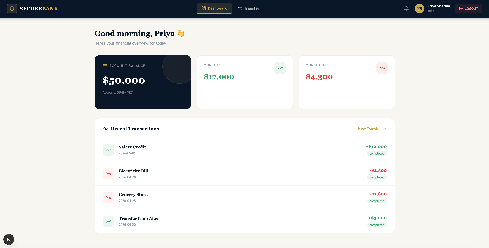

✅ **Use Case 2 complete.** Priya is now authenticated via Descope. Her session is backed by a real JWT token — not a fake in-memory state. The password was verified against the bcrypt hash imported in Use Case 1.

---

## Use Case 3 — Passkey Enrollment

### What's happening here?

In Use Case 1, every imported user was given a custom attribute `freshlyMigrated: true`. This flag is our signal that the user has just been migrated from the old system and has never set up a passkey.

After a migrated user logs in with their password (Use Case 2), the dashboard detects this flag and shows a **passkey enrollment prompt** — an overlay powered by Descope's `promote-passkeys` flow. The user can enroll their device's biometric (fingerprint, Face ID) as a passkey, or skip it for now.

Once enrolled, the flow automatically sets `freshlyMigrated: false` so the prompt never appears again. The passkey is registered against the user's Descope account and can be used for passwordless login in Use Case 4.

After this use case:
- Migrated users are prompted once to enroll a passkey after their first login
- Enrollment is handled entirely by Descope — no custom WebAuthn code
- `freshlyMigrated` is cleared by the flow on successful enrollment
- The passkey is visible in the Descope Console under the user's profile

---

### API / SDK used

**Descope Next.js SDK** — `@descope/nextjs-sdk`

| Component / Hook | What it does |
|-----------------|--------------|
| `useUser()` | Returns the logged-in user's profile including `customAttributes` |
| `<Descope flowId="promote-passkeys" />` | Renders the passkey enrollment flow inside the modal |
| `onSuccess` | Called when the user successfully enrolls (or skips) — used to close the modal |

The Flow used is **`promote-passkeys`** — a built-in Descope template that:
1. Checks if the device supports WebAuthn
2. Shows the enrollment prompt with "Add passkeys" and "Not now, maybe later" options
3. If user enrolls → triggers the browser's native biometric dialog → registers the passkey
4. If device doesn't support WebAuthn → shows a fallback screen
5. On success → runs **Update User / Attributes** to set `freshlyMigrated: false`

---

### Step 1 — Create the promote-passkeys flow in Descope Console

Go to **Console → Flows → Start from template**, then filter by **Passkeys**:

> 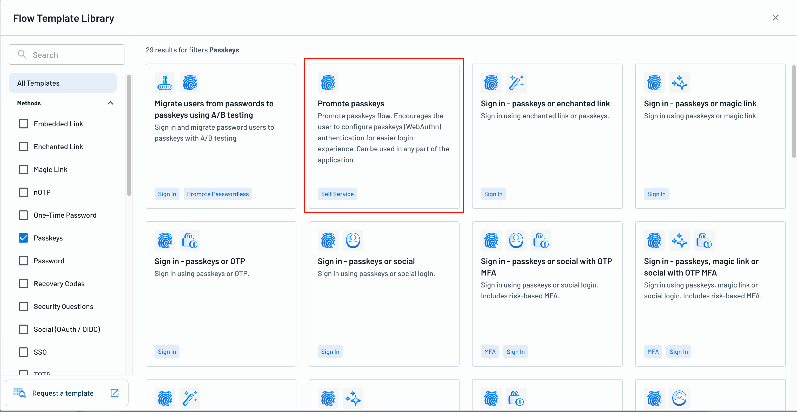

Select **"Promote passkeys"**. This creates the flow with the full enrollment journey already wired up:

> 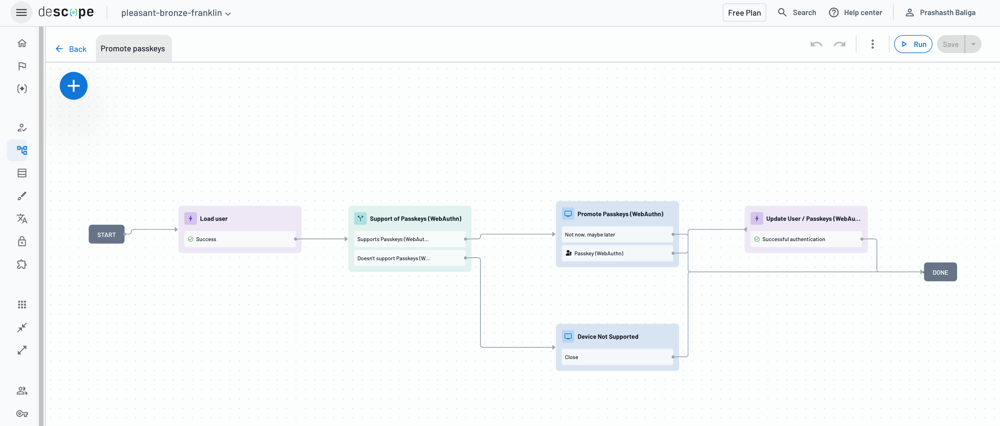

---

### Step 2 — Add the Update User / Attributes step

After enrollment succeeds, we need to clear the `freshlyMigrated` flag so the modal never shows again. Click the **+** button to add a new action, search for **"user attr"** and select **Update User / Attributes**:

> 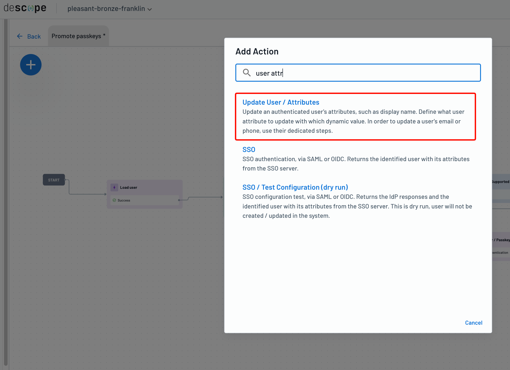

Configure it as follows — **Freshly Migrated**, type **Boolean**, value **false**:

> 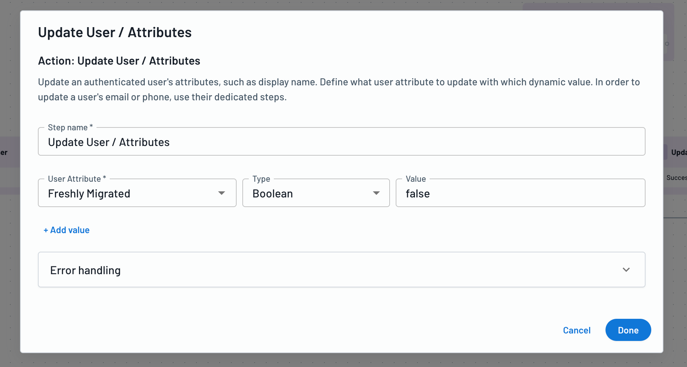

Connect **Update User / Passkeys → Successful authentication → Update User / Attributes → Success → DONE**. The final flow looks like this:

> 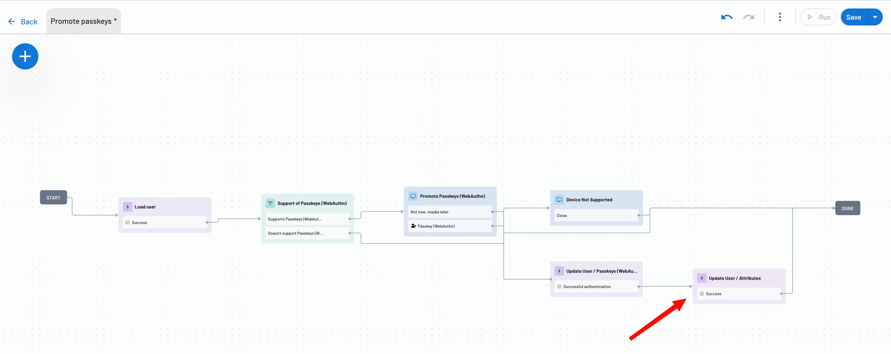

Click **Save**.

---

### Step 3 — Update `app/dashboard/page.tsx`

Open `app/dashboard/page.tsx`. We need to:
1. Check `descopeUser.customAttributes.freshlyMigrated` after login
2. Show the `promote-passkeys` flow in a modal overlay if it is `true`
3. Close the modal when the flow completes

Here is the **original file** (for reference — do not keep this):

```tsx
// ❌ No passkey check — freshlyMigrated is never read
"use client";
import { useEffect } from "react";
import { useRouter } from "next/navigation";
import { useAuth } from "@/lib/auth";
import { formatCurrency } from "@/lib/data";
import NavBar from "@/components/NavBar";
import { TrendingUp, TrendingDown, ArrowRight, CreditCard, Activity } from "lucide-react";

export default function DashboardPage() {
  const { user, transactions } = useAuth();
  const router = useRouter();
  // ❌ No useUser(), no useState, no modal — freshlyMigrated is never checked

  useEffect(() => {
    if (!user) router.replace("/");
    if (user?.role === "admin") router.replace("/admin");
  }, [user, router]);

  if (!user || user.role === "admin") return null;
  // ... rest of file unchanged
}
```

**Replace the entire file with:**

```tsx
"use client";
import { useEffect, useState } from "react";
import { useRouter } from "next/navigation";
import { useAuth } from "@/lib/auth";
import { formatCurrency } from "@/lib/data";
import NavBar from "@/components/NavBar";
import { TrendingUp, TrendingDown, ArrowRight, CreditCard, Activity } from "lucide-react";
import { Descope } from "@descope/nextjs-sdk";
import { useUser } from "@descope/nextjs-sdk/client";

export default function DashboardPage() {
  const { user, transactions } = useAuth();
  const { user: descopeUser } = useUser();
  const router = useRouter();
  const [showPasskeyModal, setShowPasskeyModal] = useState(false);

  useEffect(() => {
    if (!user) router.replace("/");
    if (user?.role === "admin") router.replace("/admin");
  }, [user, router]);

  useEffect(() => {
    if (descopeUser?.customAttributes?.freshlyMigrated === true) {
      setShowPasskeyModal(true);
    }
  }, [descopeUser]);

  if (!user || user.role === "admin") return null;

  // ... balance/transaction calculations and JSX unchanged, plus:

  return (
    <div style={{ minHeight: "100vh", background: "var(--off-white)" }}>
      {showPasskeyModal && (
        <div style={{ position: "fixed", inset: 0, background: "rgba(0,0,0,0.5)", zIndex: 100, display: "flex", alignItems: "center", justifyContent: "center" }}>
          <div style={{ background: "#fff", borderRadius: "16px", padding: "40px", width: "100%", maxWidth: "440px", boxShadow: "0 20px 60px rgba(0,0,0,0.2)" }}>
            <h2 style={{ fontSize: "20px", fontWeight: "700", color: "var(--navy)", marginBottom: "8px" }}>Set up faster login</h2>
            <p style={{ color: "var(--text-muted)", fontSize: "14px", fontFamily: "Trebuchet MS, sans-serif", marginBottom: "24px" }}>
              Use your fingerprint or Face ID to sign in — no password needed next time.
            </p>
            <Descope
              flowId="promote-passkeys"
              onSuccess={() => setShowPasskeyModal(false)}
              onError={() => setShowPasskeyModal(false)}
            />
          </div>
        </div>
      )}
      {/* ... rest of dashboard JSX unchanged */}
    </div>
  );
}
```

**What changed and why:**

| What | Why |
|------|-----|
| `import { useState }` added | We need local state to track whether the modal is open |
| `import { Descope }` added | Renders the Descope flow inside the modal |
| `import { useUser }` added | Gives us access to `descopeUser.customAttributes.freshlyMigrated` |
| `useEffect` checking `freshlyMigrated` | Runs once when the user object loads — sets `showPasskeyModal: true` if the flag is set |
| Modal overlay with `<Descope flowId="promote-passkeys" />` | Renders the enrollment flow on top of the dashboard — no page navigation needed |
| `onSuccess` and `onError` both close the modal | Success → user enrolled (flow clears the flag); Error/skip → user dismissed, flag stays until next login |

---

### Step 4 — Test the enrollment

Make sure your dev server is running:
```bash
npm run dev
```

Log in as Priya (`priya@securebank.com` / `Test@123`). The passkey enrollment modal should appear immediately on the dashboard:

> 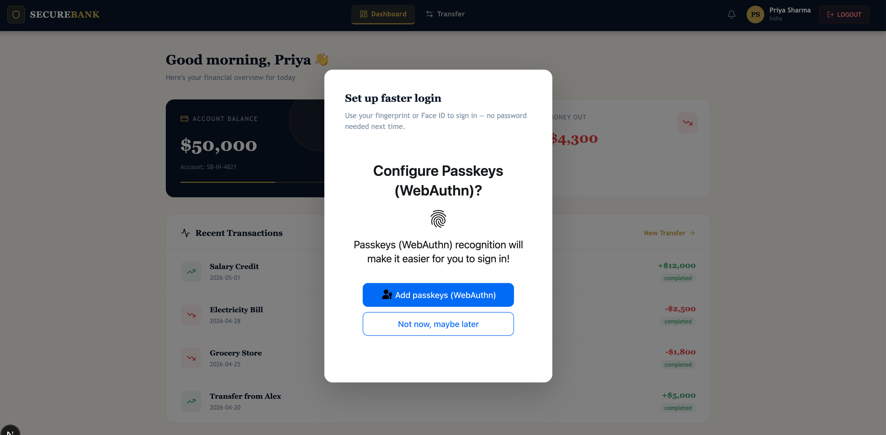

Click **Add passkeys (WebAuthn)**. Your browser will prompt for biometric confirmation. After enrolling, the modal closes and you land on the dashboard normally.

To verify enrollment, go to **Console → Users** — Priya should now show a ✓ under **Passkeys**, while Alex (who hasn't enrolled) shows ✗:

> 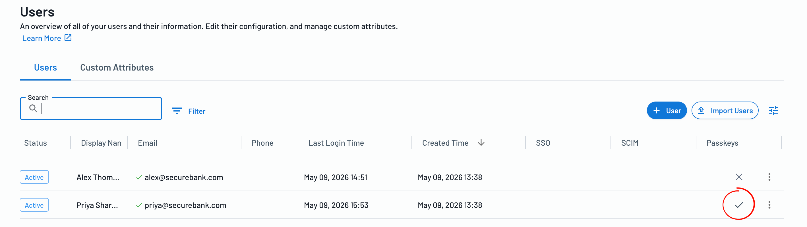

Log out and log back in as Priya — the modal should **not** appear this time because `freshlyMigrated` is now `false`.

> **Heads up:** Even though Priya has a passkey enrolled, logging back in will still take her through the **password flow** — because the login page hasn't changed yet. The passkey is registered in Descope, but nothing is telling the login page to use it. That's exactly what Use Case 4 fixes.

✅ **Use Case 3 complete.** Priya has enrolled a passkey. The `freshlyMigrated` flag was cleared by the Descope flow — no custom API code needed. She is now ready to use passwordless login in Use Case 4.

---

## Use Case 4 — Passwordless Login

### Why are we doing this?

In Use Cases 2 and 3, we used **two separate flows**:
- `sign-up-or-in-passwords` — handled login with passwords
- `promote-passkeys` — handled passkey enrollment after first login

This was a deliberate step-by-step approach. Right after the batch migration (UC1), users had passwords but no passkeys — you couldn't use a passkey-first login flow yet because nobody had enrolled one. So we let users log in with their existing password first, then nudged them toward passkey enrollment as a separate step.

Now that enrollment is in place, we can consolidate. In this use case we **replace both flows with a single smarter flow** — `sign-up-or-in-bank` — that handles every user state in one place:

| User state | Path taken |
|-----------|-----------|
| New user | Password registration → passkey enrollment prompt |
| Returning user with passkey | One tap — no password needed |
| Returning user without passkey | Password login → inline passkey enrollment prompt |

> **Note:** Technically this single flow could have been built right after UC1 — the migration gave every user a password and no passkey, so the flow would have routed them correctly from day one. The two-flow journey was a training choice, not a technical requirement. UC4 is the production-ready pattern.

---

### API / SDK used

Same SDK — `@descope/nextjs-sdk`. The only difference is the `flowId` passed to the `<Descope>` component.

The Flow used is **`sign-up-or-in-bank`** — a custom flow built by combining steps from three Descope templates (passkey sign-in, passkey-or-magic-link signup, and password sign-in). This flow:
1. Asks for an email (or offers a passkey button on the welcome screen)
2. Checks if the user exists and has a passkey → if yes, triggers the browser's biometric prompt immediately
3. If no passkey → falls back to password login
4. After password login → prompts the user to enroll a passkey inline (replaces the dashboard modal from UC3)
5. For brand-new users → sends a magic link, collects a name, then offers passkey enrollment

---

### Step 1 — Import the sign-up-or-in-bank flow into Descope Console

This flow was built by hand, combining steps from three Descope templates: passkey sign-in with device detection, passkey-or-magic-link signup for new users, and password sign-in with OTP fallback. Rather than re-building it step by step, import the pre-built version from the repo.

The flow JSON is at `flows/sign-up-or-in-bank.json` in the project. Go to **Console → Flows**, click **Import** (top-right), and upload that file.

The imported flow handles all three user states in one diagram:

> 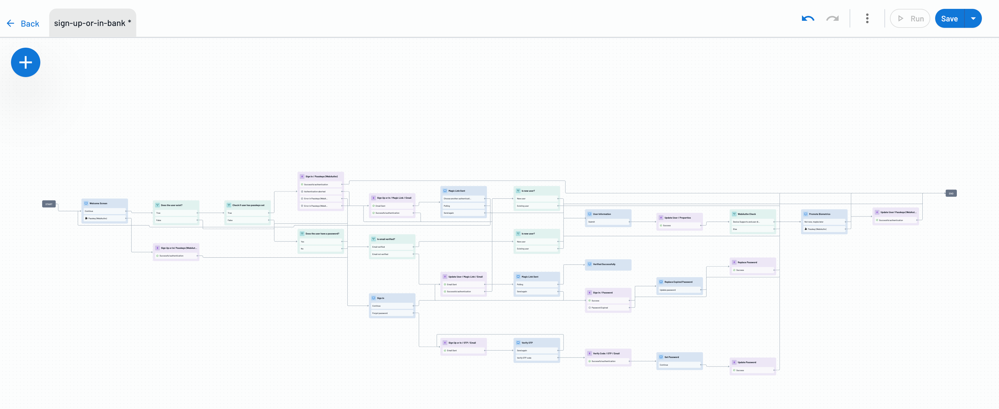

The three paths through the flow:

| User | What the flow does |
|------|-------------------|
| Returning user with passkey | Passkey button on welcome screen → biometric prompt → logged in |
| Returning user without passkey (Alex) | Email → Continue → password screen → "Configure Passkeys?" → logged in |
| Brand new user | Email → Continue → magic link → enter full name → "Configure Passkeys?" → logged in |

Click **Save** after importing.

---

### Step 2 — Update `app/page.tsx`

This is a one-line change. Open `app/page.tsx` and find the `<Descope>` component. Change the `flowId` from `"sign-up-or-in-passwords"` to `"sign-up-or-in-bank"`:

```tsx
// ❌ Before
<Descope
  flowId="sign-up-or-in-passwords"
  onSuccess={handleSuccess as never}
  onError={(e) => console.error("Auth error:", e)}
/>

// ✅ After
<Descope
  flowId="sign-up-or-in-bank"
  onSuccess={handleSuccess as never}
  onError={(e) => console.error("Auth error:", e)}
/>
```

That's the only change to this file. The login page now shows a **"Sign in with Passkeys"** button alongside the email field:

> 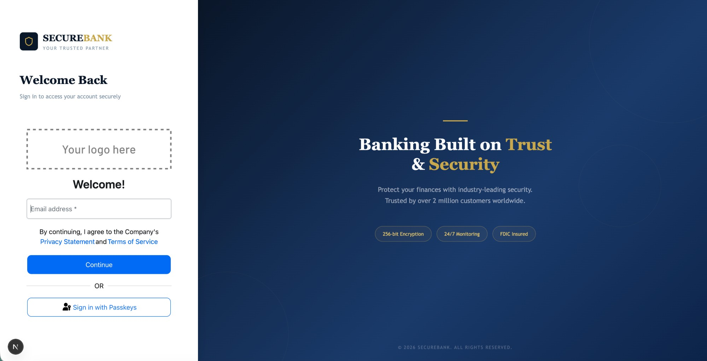

**What changed and why:**

| What | Why |
|------|-----|
| `flowId="sign-up-or-in-passwords"` → `"sign-up-or-in-bank"` | Swaps in the smarter flow — passkey-first with password fallback and inline enrollment |

---

### Step 3 — Update `app/dashboard/page.tsx`

The new flow handles passkey enrollment inline at login — so the dashboard modal from UC3 is now redundant. Remove it.

> **How to do it:** Open the file in your editor, press `Cmd+A` (Mac) or `Ctrl+A` (Windows) to select all, then delete. Paste the code below.

Here is the **key part of the UC3 file** we are removing (for reference):

```tsx
// ❌ Remove these imports
import { useEffect, useState } from "react";
import { Descope } from "@descope/nextjs-sdk";
import { useUser } from "@descope/nextjs-sdk/client";

// ❌ Remove these lines inside the component
const { user: descopeUser } = useUser();
const [showPasskeyModal, setShowPasskeyModal] = useState(false);

// ❌ Remove this entire useEffect
useEffect(() => {
  if (descopeUser?.customAttributes?.freshlyMigrated === true) {
    setShowPasskeyModal(true);
  }
}, [descopeUser]);

// ❌ Remove the entire modal JSX block
{showPasskeyModal && (
  <div style={{ position: "fixed", inset: 0, background: "rgba(0,0,0,0.5)", zIndex: 100, ... }}>
    <Descope flowId="promote-passkeys" ... />
  </div>
)}
```

**Replace the entire file with:**

```tsx
"use client";
import { useEffect } from "react";
import { useRouter } from "next/navigation";
import { useAuth } from "@/lib/auth";
import { formatCurrency } from "@/lib/data";
import NavBar from "@/components/NavBar";
import { TrendingUp, TrendingDown, ArrowRight, CreditCard, Activity } from "lucide-react";

export default function DashboardPage() {
  const { user, transactions } = useAuth();
  const router = useRouter();

  useEffect(() => {
    if (!user) router.replace("/");
    if (user?.role === "admin") router.replace("/admin");
  }, [user, router]);

  if (!user || user.role === "admin") return null;

  const txns = transactions.filter((t) => t.userId === user.id).slice(0, 5);
  const credits = txns.filter((t) => t.type === "credit").reduce((s, t) => s + t.amount, 0);
  const debits = txns.filter((t) => t.type === "debit").reduce((s, t) => s + t.amount, 0);

  return (
    <div style={{ minHeight: "100vh", background: "var(--off-white)" }}>
      <NavBar />
      <div style={{ maxWidth: "1100px", margin: "0 auto", padding: "36px 24px" }}>
        {/* Welcome */}
        <div style={{ marginBottom: "32px" }}>
          <h1 style={{ fontSize: "26px", fontWeight: "700", color: "var(--navy)", marginBottom: "4px" }}>
            Good morning, {user.name.split(" ")[0]} 👋
          </h1>
          <p style={{ color: "var(--text-muted)", fontFamily: "Trebuchet MS, sans-serif", fontSize: "14px" }}>
            Here&apos;s your financial overview for today
          </p>
        </div>

        {/* Cards row */}
        <div style={{ display: "grid", gridTemplateColumns: "1fr 1fr 1fr", gap: "20px", marginBottom: "32px" }}>
          {/* Balance Card */}
          <div style={{ background: "var(--navy)", borderRadius: "16px", padding: "28px", gridColumn: "span 1", position: "relative", overflow: "hidden" }}>
            <div style={{ position: "absolute", top: "-20px", right: "-20px", width: "120px", height: "120px", borderRadius: "50%", background: "rgba(201,168,76,0.08)", border: "1px solid rgba(201,168,76,0.15)" }} />
            <div style={{ display: "flex", alignItems: "center", gap: "8px", marginBottom: "16px" }}>
              <CreditCard size={16} color="var(--gold)" />
              <span style={{ color: "rgba(255,255,255,0.5)", fontSize: "12px", fontFamily: "Trebuchet MS, sans-serif", letterSpacing: "1.5px" }}>ACCOUNT BALANCE</span>
            </div>
            <div style={{ fontSize: "34px", fontWeight: "700", color: "#fff", marginBottom: "8px" }}>
              {formatCurrency(user.balance, user.currency)}
            </div>
            <div style={{ color: "rgba(255,255,255,0.4)", fontSize: "12px", fontFamily: "Trebuchet MS, sans-serif" }}>
              Account: {user.accountNumber}
            </div>
            <div style={{ marginTop: "20px", height: "2px", background: "rgba(201,168,76,0.3)", borderRadius: "1px" }}>
              <div style={{ width: "65%", height: "100%", background: "var(--gold)", borderRadius: "1px" }} />
            </div>
          </div>

          {/* Income */}
          <div style={{ background: "#fff", borderRadius: "16px", padding: "24px", border: "1px solid #eee" }}>
            <div style={{ display: "flex", justifyContent: "space-between", alignItems: "flex-start" }}>
              <div>
                <p style={{ color: "var(--text-muted)", fontSize: "12px", fontFamily: "Trebuchet MS, sans-serif", letterSpacing: "1px", marginBottom: "12px" }}>MONEY IN</p>
                <p style={{ fontSize: "26px", fontWeight: "700", color: "var(--success)" }}>{formatCurrency(credits, user.currency)}</p>
              </div>
              <div style={{ width: "40px", height: "40px", background: "rgba(56,161,105,0.1)", borderRadius: "10px", display: "flex", alignItems: "center", justifyContent: "center" }}>
                <TrendingUp size={20} color="var(--success)" />
              </div>
            </div>
          </div>

          {/* Spending */}
          <div style={{ background: "#fff", borderRadius: "16px", padding: "24px", border: "1px solid #eee" }}>
            <div style={{ display: "flex", justifyContent: "space-between", alignItems: "flex-start" }}>
              <div>
                <p style={{ color: "var(--text-muted)", fontSize: "12px", fontFamily: "Trebuchet MS, sans-serif", letterSpacing: "1px", marginBottom: "12px" }}>MONEY OUT</p>
                <p style={{ fontSize: "26px", fontWeight: "700", color: "var(--danger)" }}>{formatCurrency(debits, user.currency)}</p>
              </div>
              <div style={{ width: "40px", height: "40px", background: "rgba(229,62,62,0.1)", borderRadius: "10px", display: "flex", alignItems: "center", justifyContent: "center" }}>
                <TrendingDown size={20} color="var(--danger)" />
              </div>
            </div>
          </div>
        </div>

        {/* Recent Transactions */}
        <div style={{ background: "#fff", borderRadius: "16px", border: "1px solid #eee", overflow: "hidden" }}>
          <div style={{ padding: "24px 28px 20px", display: "flex", justifyContent: "space-between", alignItems: "center", borderBottom: "1px solid #f0f0f0" }}>
            <div style={{ display: "flex", alignItems: "center", gap: "10px" }}>
              <Activity size={18} color="var(--navy)" />
              <h2 style={{ fontSize: "16px", fontWeight: "700", color: "var(--navy)" }}>Recent Transactions</h2>
            </div>
            <button onClick={() => router.push("/transfer")}
              style={{ display: "flex", alignItems: "center", gap: "6px", background: "none", border: "none", cursor: "pointer", color: "var(--gold)", fontSize: "13px", fontFamily: "Trebuchet MS, sans-serif", fontWeight: "600" }}>
              New Transfer <ArrowRight size={14} />
            </button>
          </div>

          {txns.length === 0 ? (
            <div style={{ padding: "48px", textAlign: "center", color: "var(--text-muted)", fontFamily: "Trebuchet MS, sans-serif" }}>No transactions yet</div>
          ) : (
            txns.map((txn, i) => (
              <div key={txn.id}
                style={{ display: "flex", alignItems: "center", padding: "18px 28px", borderBottom: i < txns.length - 1 ? "1px solid #f5f5f5" : "none", transition: "background 0.15s" }}
                onMouseEnter={(e) => (e.currentTarget.style.background = "#fafafa")}
                onMouseLeave={(e) => (e.currentTarget.style.background = "transparent")}
              >
                <div style={{ width: "40px", height: "40px", borderRadius: "10px", display: "flex", alignItems: "center", justifyContent: "center", marginRight: "16px", background: txn.type === "credit" ? "rgba(56,161,105,0.1)" : "rgba(229,62,62,0.08)" }}>
                  {txn.type === "credit" ? <TrendingUp size={18} color="var(--success)" /> : <TrendingDown size={18} color="var(--danger)" />}
                </div>
                <div style={{ flex: 1 }}>
                  <p style={{ fontWeight: "600", color: "var(--navy)", fontSize: "14px", marginBottom: "2px" }}>{txn.description}</p>
                  <p style={{ color: "var(--text-muted)", fontSize: "12px", fontFamily: "Trebuchet MS, sans-serif" }}>{txn.date}</p>
                </div>
                <div style={{ textAlign: "right" }}>
                  <p style={{ fontWeight: "700", fontSize: "15px", color: txn.type === "credit" ? "var(--success)" : "var(--danger)" }}>
                    {txn.type === "credit" ? "+" : "-"}{formatCurrency(txn.amount, user.currency)}
                  </p>
                  <span style={{ fontSize: "11px", padding: "2px 8px", borderRadius: "12px", fontFamily: "Trebuchet MS, sans-serif", background: "rgba(56,161,105,0.1)", color: "var(--success)" }}>
                    {txn.status}
                  </span>
                </div>
              </div>
            ))
          )}
        </div>
      </div>
    </div>
  );
}
```

**What changed and why:**

| What | Why |
|------|-----|
| Passkey modal — **removed entirely** | The `sign-up-or-in-bank` flow prompts for passkey enrollment inline at login — the post-login modal is no longer needed |
| `useUser`, `useState`, `Descope` imports — **removed** | Nothing in the dashboard reads `freshlyMigrated` anymore — these imports are unused |

---

### Step 4 — Delete the promote-passkeys flow (cleanup)

The `promote-passkeys` flow is no longer referenced anywhere in the code. Clean it up from the Console.

Go to **Console → Flows**, check the box next to **promote-passkeys**, and click **Delete**:

> 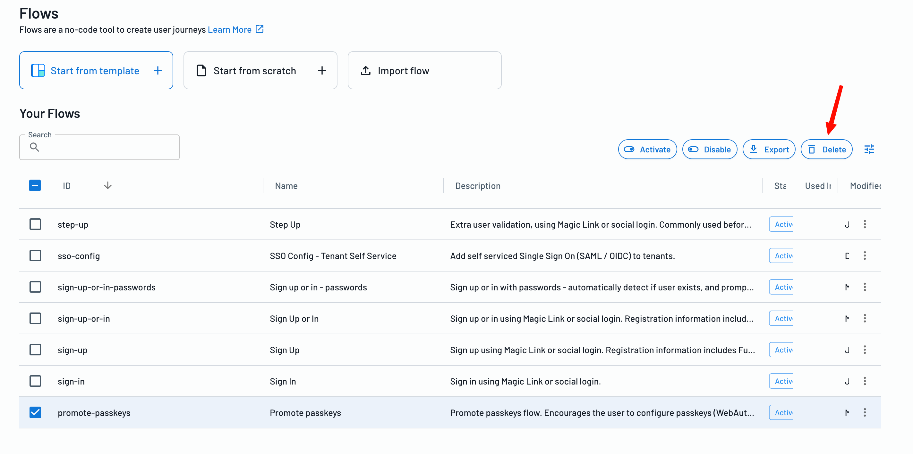

Type `Promote passkeys` to confirm deletion:

> 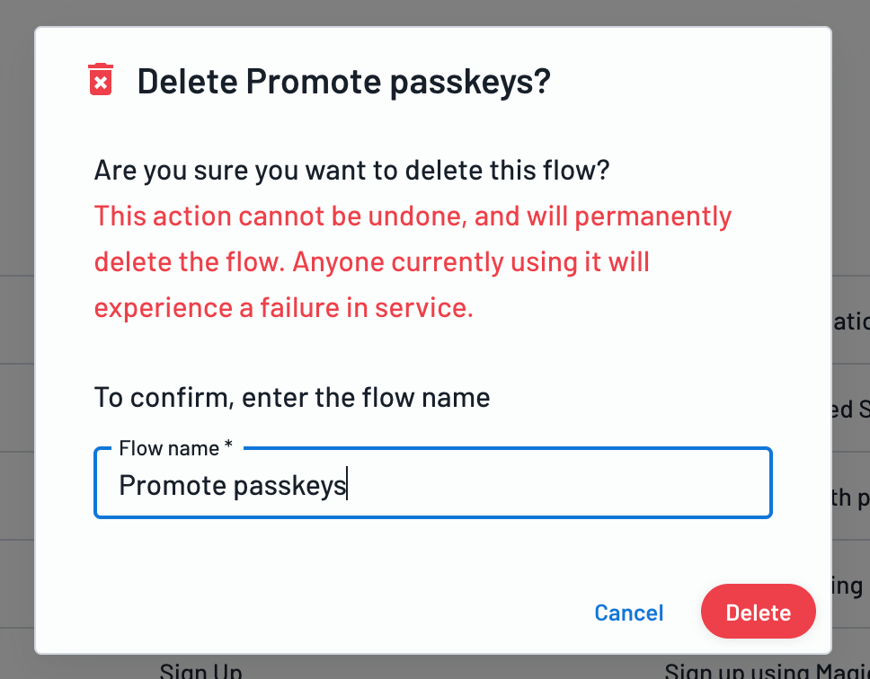

> You can also delete `sign-up-or-in-passwords` at this point since it's no longer used either.

---

### Step 5 — Test all three scenarios

Start the dev server:
```bash
npm run dev
```

**Scenario 1 — Priya (returning user with passkey enrolled):**

Enter `priya@securebank.com` and click Continue. The browser immediately shows a biometric prompt — no password screen:

> 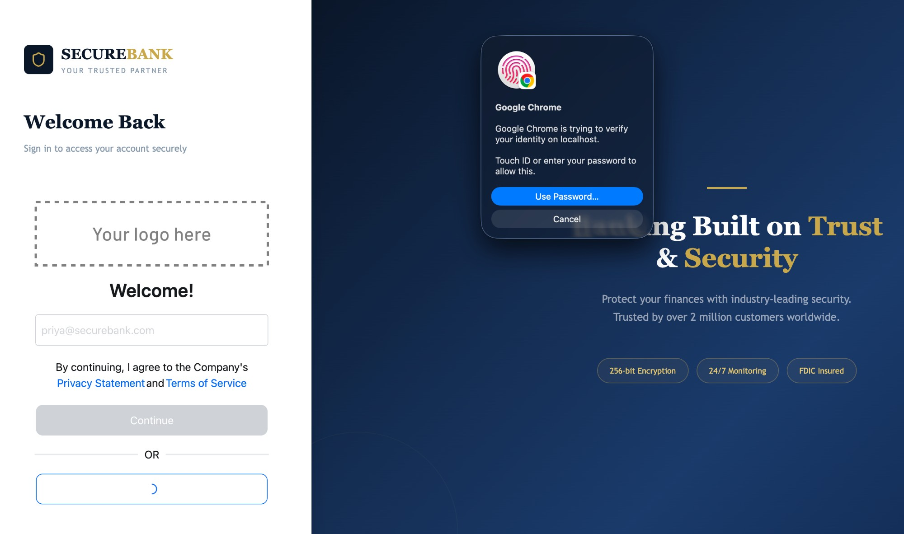

Confirm with Touch ID (or your device's biometric). Priya lands on the dashboard in one tap.

**Scenario 2 — Alex (returning user, no passkey):**

Enter `alex@securebank.com` and click Continue. Alex has no passkey, so the flow falls back to the password screen:

> 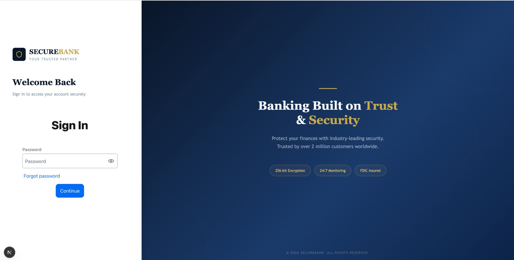

Enter `Test@123` and continue. After password verification, the flow automatically shows the passkey enrollment prompt inline — no dashboard modal needed:

> 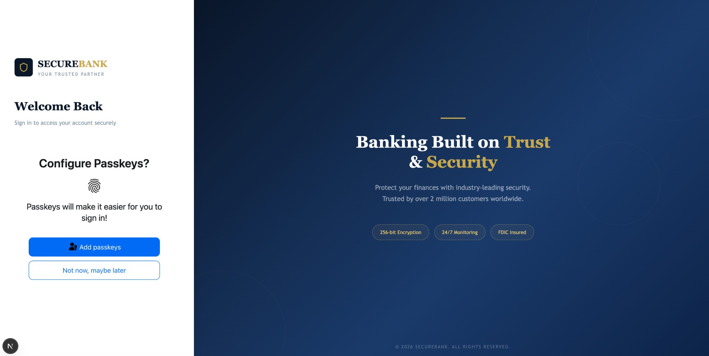

Alex can enroll or skip. Either way, he lands on the dashboard:

> 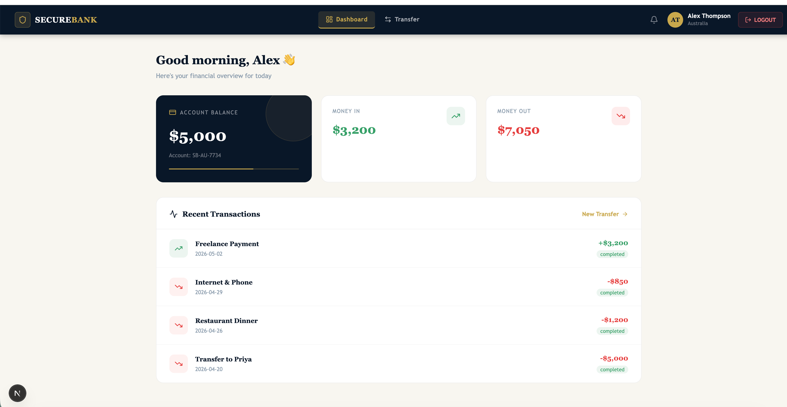

**Scenario 3 — Brand new user:**

Enter an email address that doesn't exist in Descope yet (e.g. a personal email you have access to). Click Continue. The flow detects the user doesn't exist and sends a magic link:

> 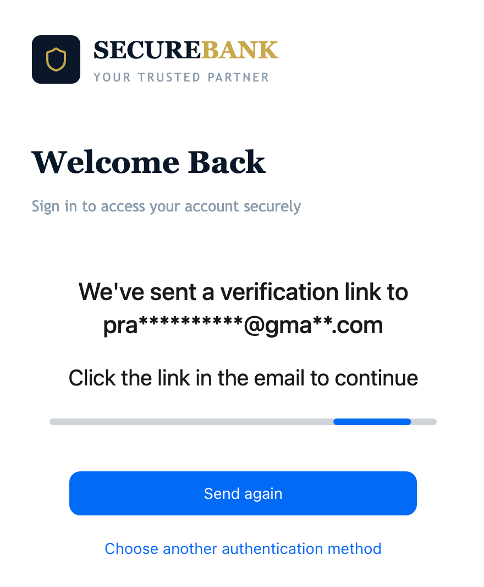

Check your inbox. You'll receive an email from Descope — the body references your Descope project name (not "SecureBank"), which is expected for a development project:

> 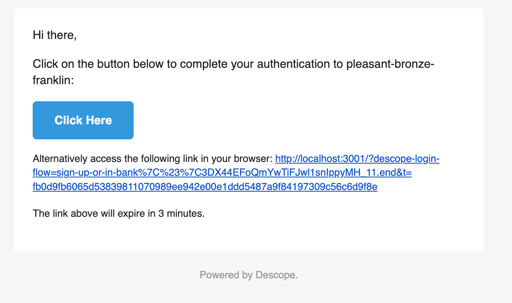

Click **Click Here**. The flow opens back in the browser and asks for a full name to complete signup:

> 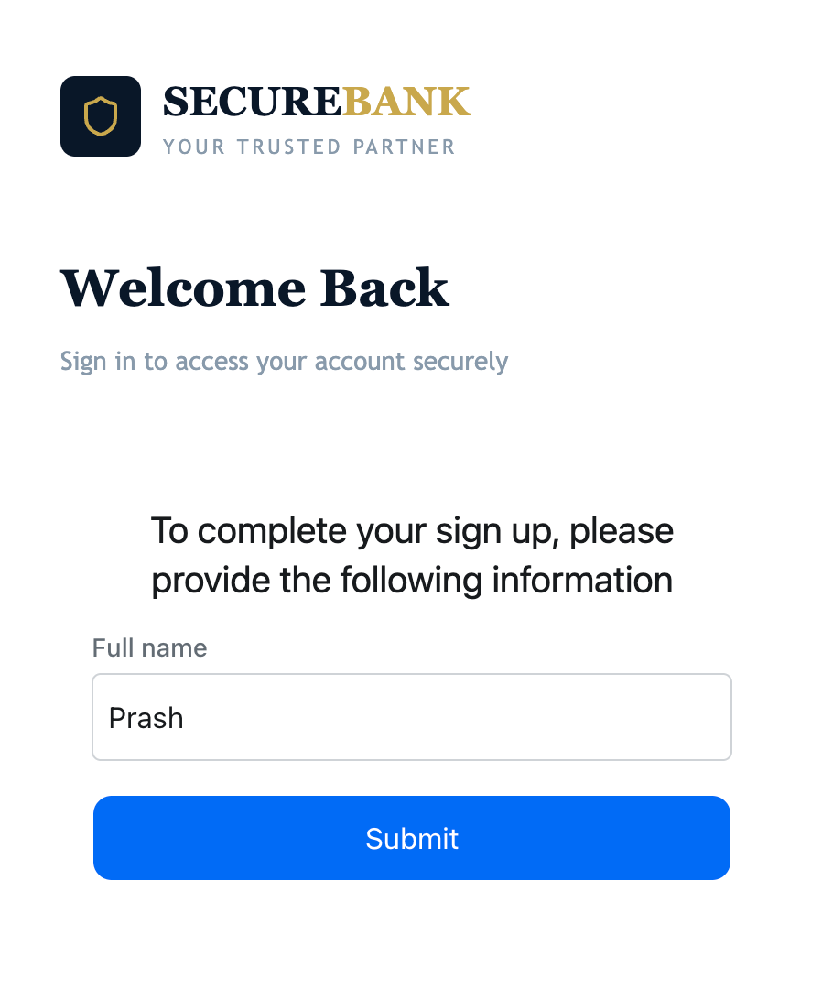

Enter your name and click **Submit**. The flow then checks if your device supports passkeys and shows the enrollment prompt:

> 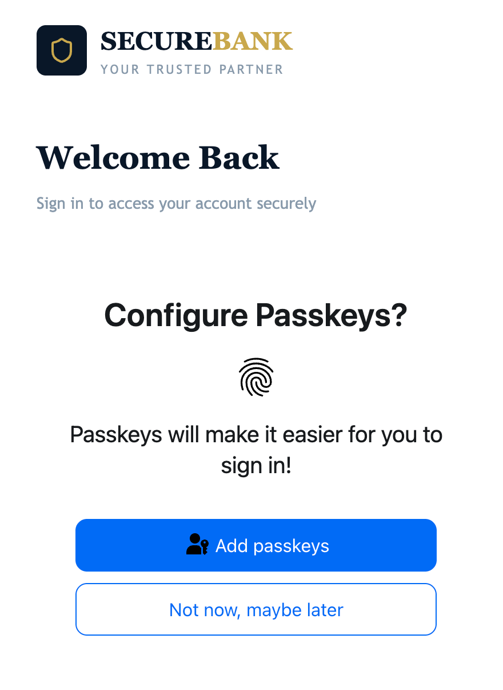

If you click **Add passkeys**, your OS will show a biometric dialog (Touch ID on Mac, Windows Hello on PC):

> 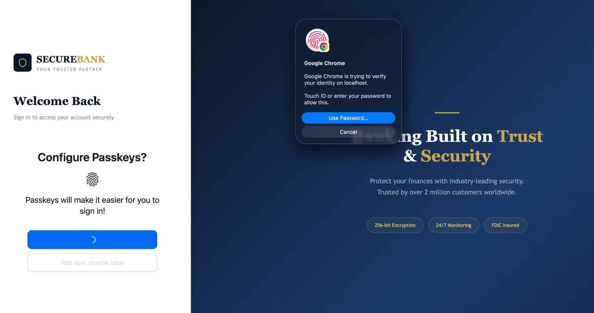

Enroll or click **Not now, maybe later** to skip. Either way, you land on the new-user welcome screen:

> 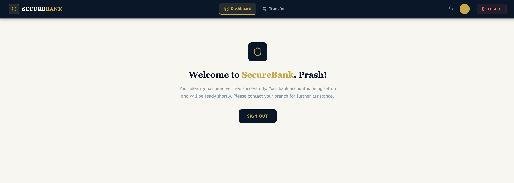

To verify, go to **Console → Users** — your new account should appear as **Active** alongside Priya and Alex:

> 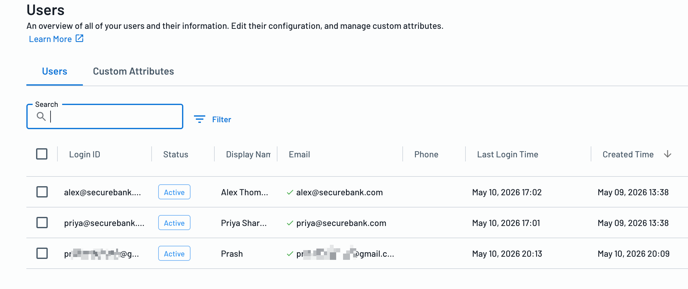

> **Note:** New users won't have a balance or transactions because `lib/data.ts` only has entries for Priya and Alex. That's expected — this scenario demonstrates the flow handles first-time signups cleanly without any extra code.

✅ **Use Case 4 complete.** One flow now handles every user state: passkey login for enrolled users, password + inline enrollment for returning users without passkeys, and magic link + name collection for brand-new signups. The dashboard is clean — no authentication logic. The `promote-passkeys` flow and the dashboard modal are gone.

---

## Use Case 5 — Password + OTP (2FA for Legacy Users)

### Why are we doing this?

Passkeys are the gold standard — but not every user will adopt them. Some users are on older devices, some are just resistant to change. In a real bank, you can't force everyone onto passkeys overnight.

In UC1, we batch-migrated Priya and Alex — two users who were already in the system. But banks don't stop onboarding people. **Sharat is a user who joined later**, after the initial migration was done. He was added individually, not as part of the bulk import. In a real scenario, this could be a walk-in customer, a referral, or someone onboarded through a different channel — someone the bank wants to give a password-based login to, but with a second factor for security.

Rather than nudging Sharat toward passkeys (like Alex), the bank has decided he'll use **password + OTP** — classic, recognisable 2FA that works on any device, any browser.

The key concept here is **conditional branching in a Descope flow** — using a custom user attribute (`otpEnabled`) to route different users down different paths inside the same flow. Sharat gets `otpEnabled: true` set on his account, and the flow checks for this after password verification to decide whether to send an OTP or offer passkey enrollment.

**Why OTP and not magic link?**
Magic links work well as a *primary* authentication method — you skip the password entirely and just click a link in your email. But as a *second factor*, they're awkward: you've just typed your password, and now you have to open your email and click a link. OTP is faster — you type a 6-digit code without leaving the page. It's also what users expect when they hear "two-factor authentication."

| User | Login path |
|------|-----------|
| Priya | Passkey → dashboard |
| Alex | Password → passkey enrollment → dashboard |
| Sharat | Password → OTP to email → account setup screen |

---

### API / SDK used

No new SDK changes — all the work happens in:
- `scripts/add-otp-user.ts` — a new one-off script to import Sharat individually (separate from the UC1 batch migration)
- Descope Console — add a custom attribute and update the flow with a condition block

> **Note:** Sharat is a brand new customer — he doesn't have an existing account in the system yet. After login he'll see an "account being set up" screen, which is intentional. The demo focuses on the authentication journey, not the account onboarding flow.

---

### Step 1 — Add `otpEnabled` custom attribute in Descope Console

Before importing Sharat, you need to define the custom attribute the flow will use to identify him.

In the Console:
1. Go to **Users** in the left sidebar
2. Click the **Custom Attributes** tab
3. Click **+ Add Attribute**
4. Name: `otpEnabled`, Type: **Boolean**
5. Click **Save**

> 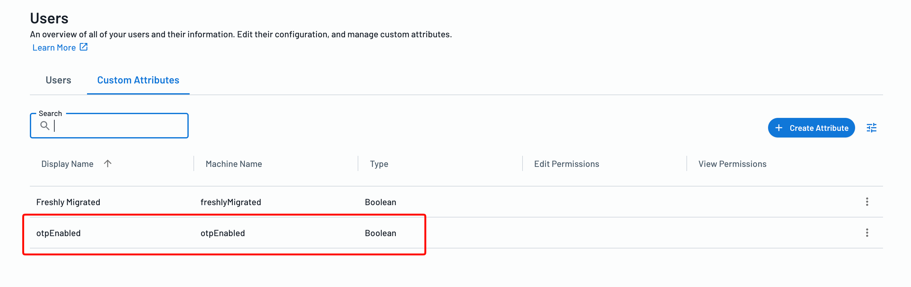

---

### Step 2 — Import Sharat into Descope

A new script handles this — `scripts/add-otp-user.ts`. It imports Sharat with his hashed password and sets `otpEnabled: true` as a custom attribute.

Run it from the project root:

```bash
npx tsx scripts/add-otp-user.ts
```

You should see:

```
Hashed password for sharatbaliga@gmail.com

Results:
  ✓ sharatbaliga@gmail.com — imported

Done.
```

Check the Console — Sharat should appear in the Users list with `otpEnabled: true` under his custom attributes.

> 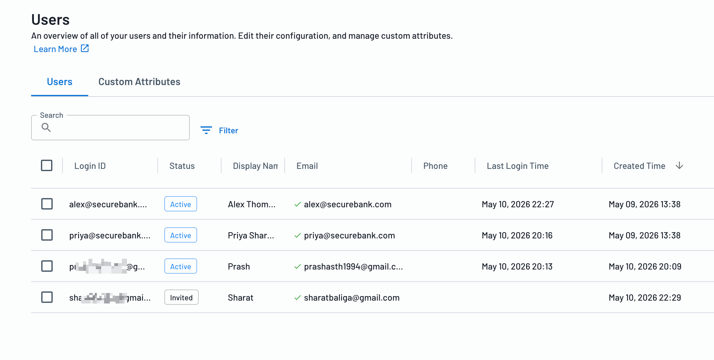

---

### Step 3 — Update the flow in Descope Console

The updated flow JSON (with the OTP condition already built in) is at `flows/sign-up-or-in-bank.json` in the repo.

**Delete the old flow and import the new one:**

1. Go to **Console → Flows**
2. Find `sign-up-or-in-bank` → click the three dots → **Delete**
3. Click **Import** (top-right) → upload `flows/sign-up-or-in-bank.json`
4. Click **Save**

The imported flow now has an **OTP Enabled** condition block after the password step:

> 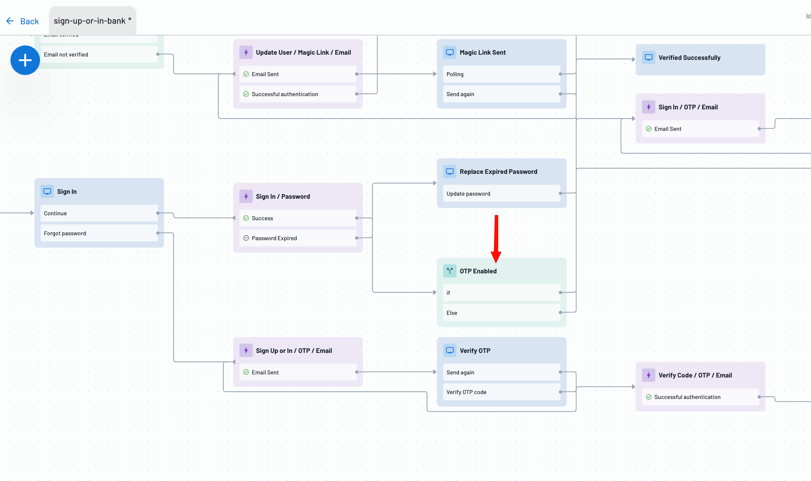

Here's what the condition is checking — click the pencil on the **OTP Enabled** block to see it:

> 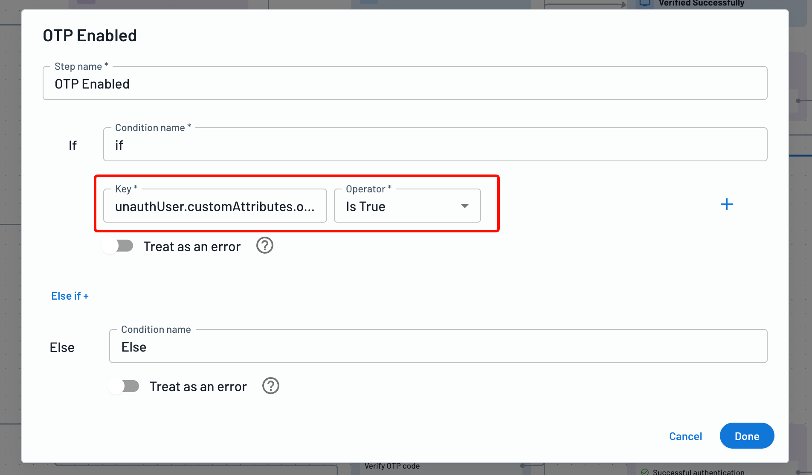

**What the new condition does:**

| Branch | Condition | Path |
|--------|-----------|------|
| `if` | `unauthUser.customAttributes.otpEnabled` Is True | Sign In / OTP / Email → Verify OTP → Verify Code → done |
| `Else` | anything else (Priya, Alex) | Promote Biometrics → passkey enrollment |

The key insight: at the point in the flow where this condition runs, the user has entered their password but isn't fully authenticated yet — so Descope uses `unauthUser` (not `user`) to access their attributes.

---

### Step 4 — Test all three scenarios

**Sharat (password + OTP):**
1. Go to the login page
2. Enter `sharatbaliga@gmail.com`
3. Enter `Test@123`
4. An OTP is sent to your email — enter the code

> 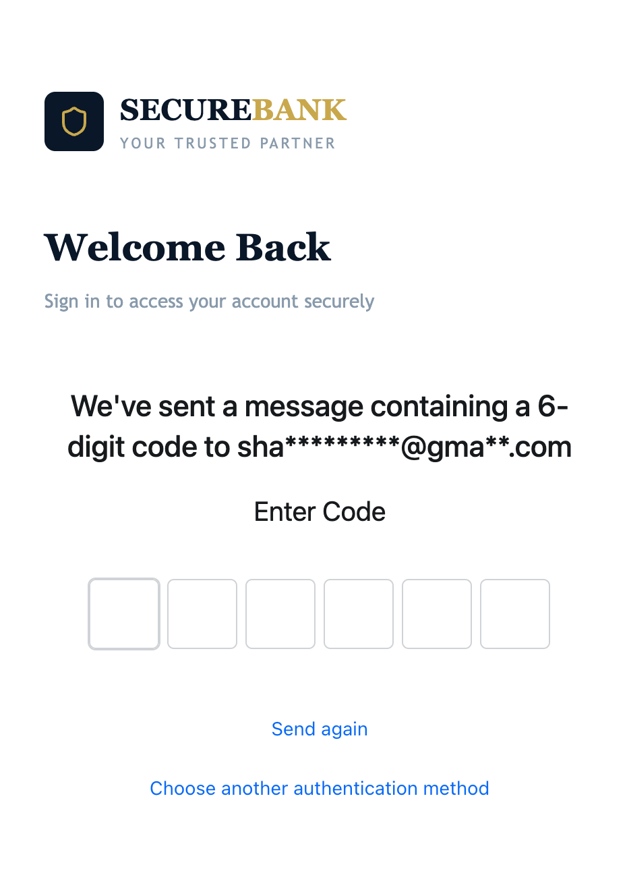

5. Sharat sees the "account being set up" screen — authentication succeeded, he just doesn't have a pre-existing account in the system yet

> 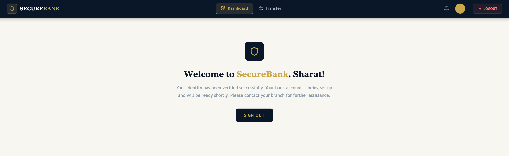

**Priya and Alex** — log in as usual to confirm their paths are unaffected.

---

### What you built

| Concept | Where it shows up |
|---------|------------------|
| Custom user attributes | `otpEnabled: true` on Sharat, absent on others |
| Conditional branching in flows | OTP Enabled condition block routes users by attribute |
| Password + OTP (classic 2FA) | Sharat's full login journey |
| Same flow, multiple paths | One flow handles 3 different user types cleanly |

---

## Use Case 6 — Session Management

> _Coming soon_

---

## Use Case 7 — Step-Up Auth

> _Coming soon_

---

## Use Case 8 — Geolocation Step-Up

> _Coming soon_

---

## Use Case 9 — Geolocation Blocking

> _Coming soon_

---

## Use Case 10 — Account Recovery

> _Coming soon_

---

## Use Case 11 — User Management

> _Coming soon_

---

## Use Case 12 — Audit Logs

> _Coming soon_
